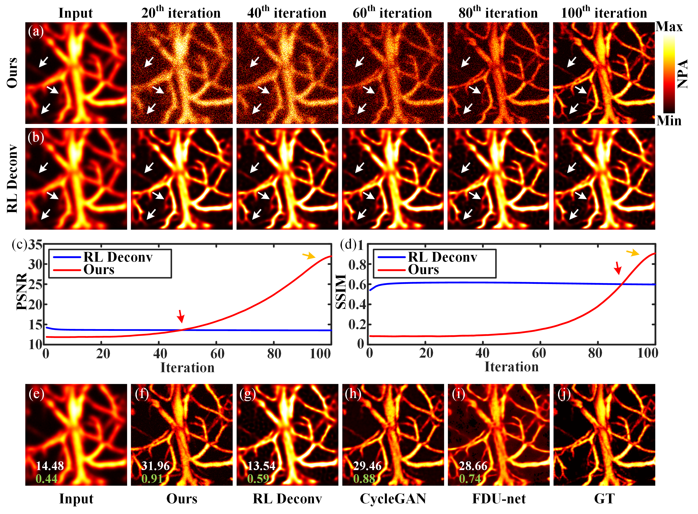

# PAM-AR2OR
Paper: Mean-reverting diffusion model-enhanced acoustic-resolution photoacoustic microscopy for resolution enhancement: toward optical resolution

Authors：Yiyang Cao, Shunfeng Lu, Cong Wan, Kangjun Guo, Xuan Liu, Yiguang Wang,  Yubin Cao, Zilong Li, Qiegen Liu and Xianlin Song

Date: August-6-2024

Version: 1.0

The code and the algorithm are for non-comercial use only.

Copyright 2024, Department of Electronic Information Engineering, Nanchang University.

**Abstract:** Acoustic-resolution photoacoustic microscopy (AR-PAM) suffers from degraded lateral resolution due to acoustic diffraction. Here, a resolution enhancement strategy for AR-PAM via mean-reverting diffusion model was proposed to achieve the transition from acoustic resolution to optical resolution. By modeling the degradation process from high-resolution image to low-resolution AR-PAM image with stable Gaussian noise (i.e. mean state), a mean-reverting diffusion model is trained to learn prior information of the data distribution. Then the learned prior is employed to generate high-resolution image from AR-PAM image by iteratively sampling the noisy state. The performance of the proposed method was validated utilizing the simulated and *in vivo* experimental data under varying lateral resolutions and noise levels. The results show that an over 3.6-fold enhancement in lateral resolution was achieved. And the image quality can be effectively improved, with a notable enhancement of ∼ 66% in PSNR and ∼ 480% in SSIM for *in vivo* data. 

## Method.

## Comparison Experiment.

## Results on point simulation data.

## Results on *in vivo* experimental data.

## Large-scale mouse brain vasculature data.

## Acknowledgement

Thanks to these repositories for providing us with method code and experimental data: https://github.com/Algolzw/image-restoration-sde, https://github.com/axd465/pam_dataset

## Other Related Projects

- Noise-insensitive defocused signal and resolution enhancement for optical-resolution photoacoustic microscopy via deep learning
    **[[Paper]](https://onlinelibrary.wiley.com/doi/10.1002/jbio.202300149)[[Code]](https://github.com/yqx7150/PAM-FDnet)**

- High-resolution iterative reconstruction at extremely low sampling rate for Fourier single-pixel imaging via diffusion model
    **[[Paper]](https://opg.optica.org/oe/fulltext.cfm?uri=oe-32-3-3138&id=545621) [[Code]](https://github.com/yqx7150/FSPI-DM)**

- Sparse-view reconstruction for photoacoustic tomography combining diffusion model with model-based iteration
    **[[Paper]](https://www.sciencedirect.com/science/article/pii/S2213597923001118) [[Code]](https://github.com/yqx7150/PAT-Diffusion)**

- Score-based generative model-assisted information compensation for high-quality limited-view reconstruction in photoacoustic tomography
    **[[Paper]](https://www.sciencedirect.com/science/article/pii/S2213597924000405) [[Code]](https://github.com/yqx7150/Limited-view-PAT-Diffusion)**
